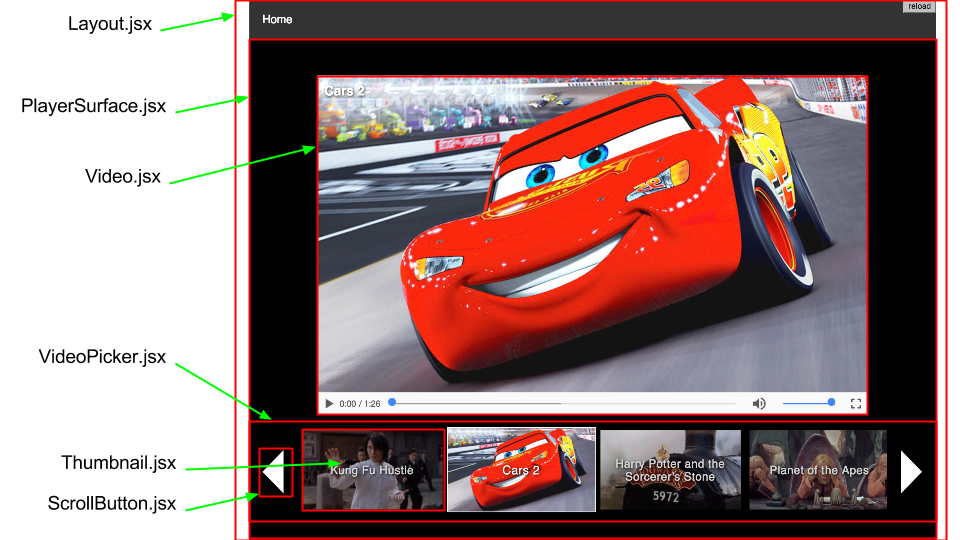

# Introduction to ES6 and ReactJS

The goal of this workshop is to get you acquainted with ECMAScript 2015, otherwise known as
**<a href="http://www.ecma-international.org/ecma-262/6.0/">ES6</a>** _(<a href="http://es6-features.org/">quick ref</a>)_, and **<a href="https://facebook.github.io/react/">ReactJS</a>**. We'll build a client-side
React app together, and then enhance it with universal rendering in **<a href="https://nodejs.org/">node.js</a>** (more on that later!)

## Goals 

By the end of this session you will:

* Have a working React web application
* Understand the most useful and interesting concepts of ES6
* Be aware of ES6 compatibility issues and how to overcome them using <a href="TODO_BABEL_LINK">Babel</a>
* Gain an understanding of universal rendering and how to implement it easily

For this tutorial, we'll be creating a small video player app. 

We're going to use the following technologies: React, Babel, react-router, webpack, node.js, express, and npm.
Don't worry if you're not familiar with these, I'll introduce them as we use them.

## ES6

ES6 is the latest version of the <a href="http://www.ecma-international.org/ecma-262/6.0/">ECMAScript standard</a>, and it supersedes ES5,
which was standardized in 2009. A lot has changed since 2009: Internet Explorer 8 was the most popular
browser, and IE represented the lion's share of usage at approximately 70% 
_(source: <a href="https://en.wikipedia.org/wiki/Usage_share_of_web_browsers">Wikipedia</a>)_.
JavaScript's latest features are very interesting and go a long way to improve some of the issues with the language's "bad parts", and introduces
some awesome new features.

Unfortunately or fortunately, depending on your perspective, 
ES6 has introduced breaking changes. While billions of devices can read and interpret JavaScript, 
from web browsers to servers to Raspberry Pi to "smart home" devices,
it is important to be mindful that many of them don't currently or will never support ES6 syntax. 
This shouldn't stop us from writing the latest code, though. 
Browser support is rapidly improving, and there is a workaround, **transpilation** (we'll go over this later).

<hr/>

## Prerequisite Steps:

_These steps are written with MacOS in mind. If you have a different operating system, your mileage may vary._

* _(If you don't have `git` installed, follow the instructions <a href="https://git-scm.com/book/en/v2/Getting-Started-Installing-Git">here</a>)_

* Clone this repository. In your terminal:

        git clone https://github.com/tedwards947/es6-react-workshop.git


### **1. Install dependencies**

##### Option 1: _(preferred)_

* Install **babel**, **express**, **react**, and **react-router**:

        npm install --save babel-cli@6.11.4 babel-core@6.13.2  \
            babel-preset-es2015@6.13.2 babel-preset-react@6.11.1 ejs@2.5.2 \
            express@4.14.0 react@15.3.1 react-dom@15.3.1 react-router@2.6.1

* Install other fun stuff like **classnames**, **urijs**

        npm install --save classnames@2.2.5 urijs@1.18.1

* Install **webpack**, **babel-loader**, and **http-server** as development dependencies:

        npm install --save-dev webpack@1.13.2 babel-loader@6.2.5 http-server@0.9.0

##### Option 2: _(if npm install is being difficult due to poor connectivity)_

* Open a web browser and navigate to 

        http://x.x.x.x:8080/node_modules.zip

* Move the zip file to the directory you just cloned from GitHub and extract it.


### **2. Get Assets**

You need to host the images and videos used in this workshop locally. 

_(If you're doing these steps outside the context of
a physical workshop, you'll need to come up with your own assets (try archive.org) and adjust the `data.js` file accordingly.)_

* Open a web browser and navigate to 

        http://x.x.x.x:8080/assets.zip

* Move the zip file to the directory you just cloned from GitHub and extract it.

We're going to use the npm package **http-server** to act as a simple CDN _(content delivery network)_ for us.
* In your terminal, from within the `es6-react-workshop` directory, do:

        ./node_modules/http-server/bin/http-server ./assets -p 8082

You should see output very similar to this:

```
Starting up http-server, serving ./assets
Available on:
        http://<your IP>:8082
Hit CTRL-C to stop the server
```

**Important: Leave this running. Open a new terminal tab/window to do subsequent steps.**

## Files 

### Data

Look at `src/data.js`. Below is an example entry:

```json
{
        "title": "Kung Fu Hustle",
        "thumbnailUrl": "http://localhost:8082/thumbs/KungFuHustle.jpg",
        "heroUrl": "http://localhost:8082/heroes/KungFuHustle.png",
        "video": {
                        "url": "http://localhost:8082/videos/KungFuHustleTrailer.mp4"
                },
        "id": 0
}
```

Each entry contains information about the video:
        
* **`title`:** the title of the video
* **`thumbnailUrl`:** the image URL for the small-sized static "poster" image
* **`heroUrl`:** the image URL for the large-sized static "poster" image, used when the video is queued but not playing
* **`video.url`:** the URL of the actual video file
* **`id`:** the ID of the video. For this example, they are numeric, but they needn't be.

Notice how the URLs contain `localhost:8082`. This will point to the **http-server** instance you set running earlier on your machine. 

### HTML Entry Point

Take a look at `src/static/index.html`. Most of it is pretty standard HTML boilerplate, so I won't go into much detail. Notice this line, however:

```html
<div id="main"></div>
```

This is where we'll tell React to inject itself in our page. 

Speaking of React, let's get to it!


# React

React is a declarative, component-based way to write user interfaces.
Rather than requiring the user _(that's you!)_ to learn a bunch of special jargon and syntax,
it uses syntax that most JavaScript developers are likely to be familiar with.

Let's take a look at a quick example to help you visualize React
and how it compares to AngularJS and "vanilla" (plain) JavaScript. 

How might we write some code that accepts an array of data and writes the items to
`<li>` elements in an ordered list (`<ol>`)?

For the following examples, the data we'll be using is:
<!--Use this opportunity to explain `let` and `const`?-->
```JavaScript
const names = [
        'Theresa',
        'David',
        'Gordon',
        'Tony',
        'John',
        'Margaret',
        'James'
];
```
The examples should all produce the same output:
>1) Theresa
>2) David
>3) Gordon
>4) Tony
>5) John
>6) Margaret
>7) James

#### "Vanilla" JS _(ES5)_:

```JavaScript
document.writeln('<ol>');
for (var i = 0; i < names.length; i++){
        document.writeln('<li>' + names[i] + '</li>');
}
document.writeln('</ol>');
```

#### "Vanilla" JS _(ES6)_:
Notice `let` instead of `var`, the new `for...of` loop, and string templating:
```JavaScript
document.writeln('<ol>');
for (let item of names){
        document.writeln(`<li>${item}</li>`);
}
document.writeln('</ol>');
```

We can also take a more functional approach and shave off 2 lines:
```JavaScript
document.writeln('<ol>');
names.forEach(item => document.writeln('<li>' + item + '</li>'));
document.writeln('</ol>');
```

<hr>

#### A quick aside on `const` and `let`:
**There is no longer a valid use case for `var`**. The new `const` and `let` fix the issue with variables hoisted outside of blocks into function scope,
as well as a few other issues.

* `let` is pretty much a direct replacement for `var` and you can use it in the same ways
* `const` prevents variable _reassignment_. **Keep in mind though that `const` is not `Object.freeze()`**
  * The following is not allowed:

        const test = {foo: "bar"};
        test = "hello world"; // <- will throw an error

  * However, the following _is_ allowed:

        const test = {foo: "bar"};
        test.foo = "Hello World";
        
<hr>

But of course plain vanilla JS doesn't scale well when working on a large app with many developers.
Let's take a look at Angular and React now.
#### AngularJS:
```HTML
<ol>
        <li ng-repeat="name in names">{{name}}</li>
</ol>
```
This is pretty declarative and its terseness is one of Angular's best features. 
Unfortunately, there's a lot of magic behind the scenes, and if you want to customize
the iterator, it can be quite complex to write your own directive.

#### React _(using JSX)_:
<!--point out the { } to enclose real js, lack of the word `function`-->
```JSX
render() {
        return (
                <ol>
                        {names.map(name => {
                            return (<li>{name}</li>); 
                        })}
                </ol>
        );
}
```

While not as terse as the 3 line example in function ES6 or Angular, I believe React's syntax is 
much better as an app's complexity increases. Notice also how we're writing JavaScript right in the middle of HTML! 

In React, this is called "JSX". Files containing JSX syntax often use the file extension `.jsx`.
We'll be working a lot more with JSX shortly so stick with me.

<hr/> 

## First Steps

We'll implement the above example for real now.
Open `src/client.jsx` in your favorite editor. Write the following:
<!--Make sure the file is empty for them?-->

```jsx
import React from 'react';
import ReactDOM from 'react-dom';

const names = [
        'Theresa',
        'David',
        'Gordon',
        'Tony',
        'John',
        'Margaret',
        'James'
];

window.onload = () => {
	ReactDOM.render(
		(<ol>
			{names.map(name => {
				return (<li>{name}</li>); 
			})}
		</ol>)
	, document.getElementById('main'));
};
```

There's a build step required to convert JSX into JavaScript that the browser can understand.
To build the project, in your terminal, from the base project directory, do:

	npm run build

This step uses **webpack** will run the **React** & **Babel** (more on Babel later) transpiler 
to convert our ES6-flavored JSX into cross-browser compatible JavaScript. 
I've configured it to use `client.jsx` as an entry point and to output the resulting
JavaScript to `src/static/js/bundle.js`. **Each time you make a change to React code in this tutorial, you'll need to re-run** `npm run build`.

If you look at `src/static/index.html` you can see that I've included our bundled JavaScript.

Let's have a look at what we have so far. In your terminal, do:

	npm run start-static

and open a browser. Navigate to `http://localhost:8080` and you should see the names listed out.

**Important: After each code change, you will need to stop the server and re-run `npm run build` and then `npm run start-static` before you can see your latest changes.** 

<hr/>

## React State

One of the best features of React is how it _reacts_ to changing application state. 
Rather than having to imperatively update the DOM when a user, say, adds an item to a list, 
React takes care of that for you because the underlying data changes. 

To demonstrate that, let's take a look at an example. 
Open `client.jsx` again, and modify it like so:

```jsx
import React from 'react';
import ReactDOM from 'react-dom';

const INITIAL_NAMES = [
	'Theresa',
	'David',
	'Gordon',
	'Tony',
	'John',
	'Margaret',
	'James'
];

class Home extends React.Component {
	constructor(props) {
		super(props);

		this.state = {
			names: INITIAL_NAMES
		};
	}

	render() {
		return (
			<div>
				<ol>
					{this.state.names.map(name => {
						return <li>{name}</li>
					})}
				</ol>

			</div>
		);
	}
}

window.onload = () => {
	ReactDOM.render(<Home />, document.getElementById('main'));
};
```
A few things to notice here:
* We're extending the `React.Component` class with the following line:
	```javascript
	class Home extends React.Component {
	```
	This creates a new ES6 class called `Home` and automatically gives it all of the fun stuff contained within `React.Component`.

* The class's `constructor` is the place to put code that is run when the class is first instantiated.
	* `super(props)` tells JavaScript to call the `constructor` method of the parent class. 
	In this case, it will call `React.Component`'s `constructor()`

* We're setting our little component with initial state with
	```javascript
	this.state = {
		names: INITIAL_NAMES
	};
	```
	At this point, we have relinquished control over our list of names to React. 
	We've set up the initial state, and now we let React handle it.

* The `render()` method is relatively unchanged, except we're `map`ping over the values 
contained in the component's state, rather than the static names array at the top.

* In `window.onload`, we're including our `<Home />` component, rather than writing the `render()` method right there.


## Reacting to State Changes

That was a lot of work for not much benefit. Let's make things dynamic so I can show off React's true power.

Modify `client.jsx` once more so that it looks like this, including the `console.log`. I know it's a lot, but I'll walk you through it.
```JSX
import React from 'react';
import ReactDOM from 'react-dom';

const INITIAL_NAMES = [
	'Theresa',
	'David',
	'Gordon',
	'Tony',
	'John',
	'Margaret',
	'James'
];

class Home extends React.Component {
	constructor(props) {
		super(props);

		this.state = {
			names: INITIAL_NAMES,
			textboxValue: ''
		};

		this.handleChange = this.handleChange.bind(this);
		this.handleButtonClick = this.handleButtonClick.bind(this);
	}

	handleChange(event) {
		//we're using React to manage the textbox's state
		this.setState({
			textboxValue: event.target.value
		});
	}

	handleButtonClick() {
		if (this.state.textboxValue === ''){
			//do nothing if the textbox is empty
			return false;
		}
		const _names = this.state.names;
		_names.push (this.state.textboxValue);

		//updates the component's state, including the names array and nulling out the textbox's value
		this.setState({
			names: _names,
			textboxValue: ''
		});
	}

	render() {
		console.log('render method called. current state:', this.state);
		return (
			<div>
				<input type="text"
					   value={this.state.textboxValue}
					   onChange={this.handleChange} />
				
				<input type="button"
					   onClick={this.handleButtonClick}
					   value="Add Name" />}

				<ol>
					{this.state.names.map(name => {
						return <li>{name}</li>
					})}
				</ol>

			</div>
		);
	}
}

window.onload = () => {
	ReactDOM.render(<Home />, document.getElementById('main'));
};
```

After you navigate to the new page, open the developer console. Start typing in the textbox. Notice that the logging statement you added gets called after each
keystroke. React is detecting that the state changed and is updating the DOM (in `render()`) to reflect that. 
Don't worry, React has a very performant way of diffing and determining a minimum set of changes it needs to make to the DOM. 
A complete explanation of this mechanism is unfortunately outside the scope of this tutorial, but if you're interested, <a href="https://www.codecademy.com/articles/react-virtual-dom">here is a page explaining how it works.</a>

Notice that we're using native JS events to tell React what to do (`onChange`, `onClick`). We point them to methods on the class, `handleChange()` and `handleButtonClick()`, respectively.
In the class's `constructor` method, we need to bind `this` to these functions. 
```Javascript
this.handleChange = this.handleChange.bind(this);
```
If we don't, `this` refers to the class definition instead of an instance, as we would expect.
 

## React Components

React is fairly opinionated when it comes to the layout of code. Components are a way to package UI features into reusable and relatively atomic portions. 
Let's componentize some of the example above.

One obvious choice for componentization is the textbox and button. We should make that bit of UI a component for a few reasons:
* It could be reused other places in our app, any time we wanted a textbox and a button
* We can more easily reason what that bit of code does, because its inputs and outputs are restricted
* It makes the code more maintainable and readable

We'll rip out the two `<input>` tags and replace them with a component!

Once again, edit `client.jsx`:

```JSX
import React from 'react';
import ReactDOM from 'react-dom';

const INITIAL_NAMES = [
	'Theresa',
	'David',
	'Gordon',
	'Tony',
	'John',
	'Margaret',
	'James'
];

class NameInput extends React.Component {
	constructor(props) {
		super(props);

		this.state = {
			textboxValue: ''
		};

		this.handleChange = this.handleChange.bind(this);
		this.handleButtonClick = this.handleButtonClick.bind(this);
	}

	handleChange(event) {
		//we're using React to manage the textbox's state
		this.setState({
			textboxValue: event.target.value
		});
	}

	handleButtonClick() {
		if (this.state.textboxValue === ''){
			//do nothing if the textbox is empty
			return false;
		}

		//calls the onAddValue function passed to this component as a prop
		//we pass it as an argument so that the parent component can handle the new value.
		this.props.onAddValue(this.state.textboxValue);

		//now we null out this component's textboxValue to erase it.
		this.setState({
			textboxValue: ''
		});
	}

	render() {
		return (
			<div>
				<input type="text"
					value={this.state.textboxValue}
					onChange={this.handleChange} />

				<input type="button"
					onClick={this.handleButtonClick}
					value={this.props.buttonText} />
			</div>
		);
	}
}

class Home extends React.Component {
	constructor(props) {
		super(props);

		this.state = {
			names: INITIAL_NAMES
		};

		this.handleAddValue = this.handleAddValue.bind(this);
	}

	handleAddValue(value) {
		const _names = this.state.names;
		_names.push(value);

		//updates this component's state
		this.setState({
			names: _names
		});
	}

	render() {
		console.log('render method called. current state:', this.state);
		return (
			<div>
				<NameInput buttonText="Add a new value" onAddValue={this.handleAddValue}/>
				
				<ol>
					{this.state.names.map(name => {
						return <li>{name}</li>
					})}
				</ol>
			</div>
		);
	}
}

window.onload = () => {
	ReactDOM.render(<Home />, document.getElementById('main'));
};
```

Some more big changes here:
* We've broken out the `<input>` tags into a new class `NameInput`:
	```javascript
	class NameInput extends React.Component {
	```
	Notice also that we've changed the `render()` method of `Home` to no longer have the textbox and button, but rather:
	```JSX
	<NameInput buttonText="Add a new value" onAddValue={this.handleAddValue} />
	```

* The methods `handleChange()` and `handleButtonClick()` have been moved to the `NameInput` class. 
With a few exceptions, (unfortunately outside the scope of this tutorial), atomic components like this should be responsible for handling their own state.

* The button's text is being provided to `NameInput` by it's parent, `Home`. When we include `NameInput`:
	```jsx
	<NameInput buttonText="Add a new value" ...
	```
	we are passing the text we want for the button as a **prop**. You can see that in `NameInput`, the button's code is:
	```jsx
	<input type="button"
		onClick={this.handleButtonClick}
		value={this.props.buttonText} />
	```
	We set the `value` of the `<input>` to be `this.props.buttonText`.

* Our new `NameInput` component will be responsible for handling the state changes of user input, and only when the user clicks the "Add Name" button, will it 
report to its parent (`Home`) that a new name should be added to the list.

* When `NameInput` says it wants to add a new name to the list, it calls `this.props.onAddValue()` method. The handler for this method is within `Home`, `handleAddValue()`. 
That handler is passed from parent to child in the exact same way that we dictated the button text. 
	```JSX
	<NameInput buttonText="Add a new value" onAddValue={this.handleAddValue} />
	```

For the purposes of this contrived example, I added both components to the same file. In reality, each component should have its own file. This will be demonstrated shortly.

# Our Video Player App
Now that you have a basic understanding of React's `state` and `props`, let's start building the video player!

## What we're building



_(The red lines denote the boundaries of React components.)_

* **Layout.jsx**: The wrapper parent component that contains the header and body of our app.
* **PlayerSurface.jsx**: This component is the body of our app.
It houses the video and the thumbnail picker, as well as acting as the controller.
* **Video.jsx**: Contains the logic required to render the `<video>` element
* **VideoPicker.jsx**: This component handles video selection. It includes `Thumbnail`s and `ScrollButton`s and controls the logic for their selection.  
* **Thumbnail.jsx**: Straightforward component that displays an image and offers a click handler.
* **ScrollButton.jsx**: Simple button wrapper that tells `VideoPicker` to scroll left or right.

## Single Page Application

We'll take things a bit further by making this a single page app.
When a user selects a different video, we'll update the URL in the browser. Updating the URL will trigger the video to change.
In this app, this provides a streamlined way to share the URL to friends and drive them to the video:
`/video/5`, where "5" is the ID of the video. This URL change will not require a call to the server, so that's why it's called a "Single Page App".

## Introducing React Router

React Router is a routing library built for React. 
It follows React's component-based architecture very well, 
and so it makes perfect sense to use for this example app. 
Once we set it up, it should be straightforward to add new routes as we need.

Let's get started. 
Within `src/` make a new file called `Routes.jsx` and open it in your editor. Add:

```jsx
import React from 'react'
import { Route, IndexRoute } from 'react-router'
import Layout from './components/Layout.jsx';
import PlayerSurface from './components/PlayerSurface.jsx';
import NotFound from './components/NotFound.jsx';

const routes = (
	<Route path="/" component={Layout}>
		<IndexRoute component={PlayerSurface}/>
		<Route path="video" component={PlayerSurface} />
		<Route path="video/:id" component={PlayerSurface} />
		<Route path="*" component={NotFound}/>
	</Route>
);

export default routes;
```

* With ES6, we can import just portions of a file with the syntax:  _(more info <a href="https://developer.mozilla.org/en-US/docs/Web/JavaScript/Reference/Statements/import">here</a>)_ 
	```javascript
	import {foo, bar} from "my-module";
	```
* Besides importing **react** and **react-router**, we're importing
	* `Layout.jsx`
	* `PlayerSurface.jsx`
	* `NotFound.jsx` (for our 404 route)

	We'll make these files soon.


* The first bit of JSX defines the layout we're going to use for our app:
	```jsx
	<Route path="/" component={Layout}>
	```

* The first child of `<Route>` defines the index path (`/`). When a user lands on our site with no path, this is the page we'll render.
	```jsx
	<IndexRoute component={PlayerSurface}/>
	```

* The same goes for `/video`. We'll render the `PlayerService` component.

* We want to use React router to pass the video ID from the path to our app, and we do that with the Express-like syntax: `video/:id`. Anything that is given after `video/` will be passed to our app, and the app will decide how to handle it.
	```jsx
	<Route path="video/:id" component={PlayerSurface} />
	```

* The last `<Route>` matches for anything other than `/`, `/video`, and `/video/:id`. We'll render our 404 page in this case.

One last bit of **react-router** config. In `src/components`, make & open `AppRoutes.jsx`:

```jsx
import React from 'react';
import { Router, browserHistory } from 'react-router';
import routes from '../routes.jsx';

export default class AppRoutes extends React.Component {
    render() {
        return (
            <Router history={browserHistory} routes={routes} />
        );
    }
}
```

* This is the entry point for **react-router**. We're configuring it to use the vanilla browserHistory API and to use the routes we just created in `Routes.jsx`.

That's it! **react-router** will handle the rest of the heavy lifting for us. We'll be able to see it working soon, so stay with me.

## Layout

Most web app frameworks require a layout template on which to build your app. This app is no different. Within `/src/components`, make `Layout.jsx` and open it in your editor.

```jsx
import React from 'react';
import { Link } from 'react-router';

export default class Layout extends React.Component {
    render() {
        return (
            <div id="layout" className="layout">

                <header>
                    <Link to="/">
                        <span class="logo">Home</span>
                    </Link>
                </header>

                <div className="content">
                    {this.props.children}
                </div>
            </div>
        );
    }
}
```

* We're importing `Link` from **react-router**. This is the easiest way to add links between routes in React.

* Our `<header>` is static in this case, but it doesn't have to be. More complex apps could have an entire navigation component included here, for example.

* Notice `{this.props.children}`. Earlier, in `Routes.jsx`, you saw that we had components nested inside other components, just like real HTML. The same goes with React. Components nested in this fashion are passed to their children via `this.props.children`. The developer is responsible for implementing rendering them. 

## PlayerSurface

We'll be coming back to this file later, but for now, in `src/components`, create `PlayerSurface.jsx` and open it up. For now:

```jsx
import React from 'react';
export default class PlayerSurface extends React.Component {
    render() {
        return (
			<div>
				<span>Hello world!</span>
				<span>The value of <pre>:id</pre> is {this.props.params.id}.</span>
			</div>
		);
	}
}
```

* Notice how I'm referencing `this.props.params.id`. The `params` object contains parameters passed in the path, and we can do anything we want with the params now, including just writing them to the page.

## NotFound

Our 404 page is simple enough:

```jsx
import React from 'react';
import { Link } from 'react-router';

export default class NotFound extends React.Component {
    render() {

        return (
            <div className="not-found">
                <h1>404 - Not Found</h1>
                <Link to="/">Click here to return home.</Link>
            </div>
        );
    }
}
```

* Simple enough. Notice though that we provide a `<Link to="/">` to allow the user an easy way home.

## Hello World?

We have now done _almost_ enough work to stand up our very first React web app. Sure it doesn't do much, but we'll enhance it soon.

The last thing to do is to modify `src/client.jsx` to use our new router:

```jsx
import React from 'react';
import ReactDOM from 'react-dom';
import AppRoutes from './components/AppRoutes.jsx';

window.onload = () => {
  ReactDOM.render(<AppRoutes/>, document.getElementById('main'));
};
```

* This tells React to render `<appRoutes/>` in the main area of our HTML.

Now that that's done, rebuild the project and run it:
```
npm run build
```
and
```
npm run start-static
```

Navigate to `localhost:8080` to (hopefully) see "Hello World!" If that works, try typing a bogus route like `localhost:8080/foobar`, and see how our 404 page works. 
After that, go to `localhost:8080/video` and `localhost:8080/video/2` to see how the params are written to the page.

<hr/>

## Video

Now that we've stood up a functional app, let's start making it useful. One by one, we'll add more components to `PlayerSurface.jsx` until it resembles the example image above.
We'll start with `Video.jsx`. Create it in `src/components` and open it.

```jsx
import React from 'react';

export default class Video extends React.Component {
    constructor() {
        super();

        this.togglePlayState = this.togglePlayState.bind(this);
    }

    togglePlayState() {
        if (this.video.paused){
            this.video.play();
        } else {
            this.video.pause();
        }
    }

    componentDidUpdate(previousProps, previousState){
        if(previousProps.source !== this.props.source){
            /*
                We need to imperatively call .load() here because while React's render() will update the 
                <source> within <video>, <video> will not reload automatically.
            */
            this.video.load();
        }
    }

    render() {
        return (
            <div className="video-wrapper" onClick={this.togglePlayState}>
                <h3>{this.props.title}</h3>
                <video controls height="700" width="1200" 
                       poster={this.props.poster} 
                       ref={(ref) => {this.video = ref;}}>

                    <source src={this.props.source} type={TYPE} />

                    {/* Fallback text for browsers that don't support HTML5 playback... */}
                    Your browser does not support HTML5 Video playback
                </video>

            </div>
        );
    }
}
```

I'll start with `render()` and work my way backwards:

### `render()`

* Notice the `onClick` handler on the video wrapper. This is to play/pause the video when the user clicks anywhere on the video surface.

* The `<h3>` wraps the selected video's title.

* This app uses the HTML5 `<video>` tag. If you're not familiar with it, W3 Schools offers <a href="http://www.w3schools.com/html/html5_video.asp">a nice tutorial.</a> For now, I'll walk you through it.

* `<video>` has a few  attributes:
	* `controls`: Whether or not the browser should render video controls for the video
	* `height`, `width`
	* `poster`: A placeholder image to use while the video is loading, is paused, or finishes.
	* `ref`: This isn't a built-in HTML attribute. It's very powerful though, and I'll get to it in a minute.

* Within `<video>`, _n_ `<source>` tags are added to specify the possible video files to use. You might use more than one `<source>` when specifying different filetypes, for example. For our little example, we'll just use one.

* The plain text following the `<source>` elements is used if the browser doesn't support video playback. Most do, but to be safe, we include it here.

### `componentDidUpdate(previousProps, previousState)`

* This is an example of a React <a href="https://facebook.github.io/react/docs/component-specs.html">"Lifecycle Method"</a>. Others will be introduced later.

* This function is called after React has reacted to a change of state and has re-rendered (if it needed to). It provides the previous state's props and states, so we can do some imperative logic with them.

* In this case, we're using it to check if the source changed from what it used to be. If it has, this means that the user has selected a different video

* We then imperatively call `<video>`'s `load()` method to tell it to fetch the video asset.

* **Important**: Notice how we're able to access the `<video>` element directly. This is because in the `render()` method, we assigned the `<video>` a `ref`.

### **A Quick Aside on Refs**

It's often important to have a reference to a DOM element directly. While in general you should use React's way of reacting to state to drive changes in your application,
there might be times where you simply cannot avoid working with the element itself. One example of this is when you need to call functions on the element itself. 

Here's how this works:

```jsx
<video ref={
    (ref) => {this.video = ref;}
}></video>
```

`ref` allows you to pass a callback that gets called when the component is mounted. It provides a reference to the element as an argument.
We can then use this reference to add it to our React component via `this.video = ref;`

After it's mounted & our element is now added to our React component object, we can reference it directly by 

### `togglePlayState()`

* This is an event handler for when the user clicks on the video surface.

* We're just checking if the video is paused, and if it is, we `play()` it, otherwise we `pause()` it.

### `constructor()`

* This is the same as other constructor methods on other classes, except we need to be sure to:
	```javascript
	this.togglePlayState = this.togglePlayState.bind(this);
	```
	We have to bind `this` to the `togglePlayState` method. If we don't, when we go to call the method, it will refer to a static method that is shared between all instances of our `Video` class, not the instance we're concerned with.
	When `constructor()` gets called, it will bind `this` to the method: `this` being a reference to the current instance.

## PlayerSurface, Part II

Go back and open `src/components/PlayerSurface.jsx`. Enter the following:

```jsx
iimport React from 'react';

import Video from './Video.jsx';
import videos from '../data/data.js';

export default class PlayerSurface extends React.Component {
    constructor(props) {
        super(props);

        //we'll use the class's constructor to define this component's initial state
        const videoIdFromRouter = this.props.params.id;
        this.state = {
            selectedVideo: this.getVideoById(videos, videoIdFromRouter)
        };
    }

    componentWillReceiveProps(nextProps) {
        //note: this method is not called for the initial render

        //we'll use it here to react to videoId changes from React Router
        const videoIdFromRouter = nextProps.params.id;

        //setState() causes React to rerender
        this.setState({
            selectedVideo: this.getVideoById(videos, videoIdFromRouter)
        });
    }

    getVideoById(videos, videoId) {
        let foundVideo;
        if (videoId) {
            //look for the video in our data
            foundVideo = videos.find(item => {
                //I used weak `==` in case '5' or 5, for example
                return item.id == videoId;
            });
        } 

        if (!foundVideo){
            //pick the first one
            foundVideo = videos[0];
        }
        
        return foundVideo;
    }

    render() {
        const source = this.state.selectedVideo.video.url;
		const poster = this.state.selectedVideo.heroUrl;
		const title = this.state.selectedVideo.title;

        return (
            <div className="player-surface">
				<input type="button" value="Test!" onClick={() => {
                    //test method
                    const selection = prompt('Which video?');
                    this.setState({
                        selectedVideo: this.getVideoById(videos, selection)
                    });
				}} />
                <Video source={source} 
                       poster={poster}
                       title={title} />
            </div>
        );
    }
}
```

I'm going to start from the top of the file this time:

* Notice we're `import`ing our new `Video` React component, as well as our data module.

### `constructor(props)`

* We're passing `props` as an argument to `super()` so that the parent class can have access to this component's props.

* `constructor()` is an ideal place to set up a component's initial state. 

  * We get the `id` from **react-router** by accessing it here:
	```javascript
	const videoIdFromRouter = this.props.params.id;
	```

  * Now that we have the video's ID, we'll pass it to our function `getVideoById()` to retrieve the corresponding data map, and we set the component's state:
	```javascript
	this.state = {
		selectedVideo: this.getVideoById(this.props.videos, videoIdFromRouter)
	};
	```

### `getVideoById(videos, videoId)`

This method accepts our data map and retrieves the entry that corresponds to `videoId`. 
If we provide it an ID it doesn't recognize, it returns the first video.
_(If we were shipping this app to production, we might want to have some error handling instead of just selecting the first video.)_

### `componentWillReceiveProps(nextProps)`

This is another "Lifecycle Method", and this particular one gets called when a parent component changes a component's props. 
It provides `nextProps` as an argument, which is the future state of our component's props. To access the current props. Use `this.props` as usual.

Here we're using it to react to **react-router** changing the ID when we navigate to a new path.

### `render()`

* First, I'm storing values with a long path in `const`s to make the JSX appear cleaner. This is just a style thing, and it's not at all required.

* Within the wrapper `<div>`, I've created a quick test button that will allow us to switch videos without a video picker.
  Notice that `this` means the react component. Had I written this function in ES5, it would look like:
  ```javascript
	onClick = { function() {
		//test method
		var selection = prompt('Which video?');
		this.setState({
			selectedVideo: this.getVideoById(videos, selection)
		});
	}}
  ```
	but `this` would **not** refer to the React component, but rather the click handler function. We'd have to use `bind(this)` to get the correct value of `this`.
	With ES6 arrow function syntax, `this` is the value we expect.

* We're then including our `<Video` component and passing the props it expects.

We've now got enough written to test it out again! Do:

```
npm run build
```
and
```
npm run start-static
```
and go to `localhost:8080`. The first video should be selected, and it should be playable. 
After you confirm that it plays, click the test button and enter a new number for the video ID (check `data/data.js` for possible values.)

## Thumbnail 

We've got a working video player and that's great, but having a `prompt()` box isn't the prettiest of user interfaces. 
Let's enhance it with a horizontal scrolling list of videos. 

The first step is to make a Thumbnail component that is responsible for rendering an image, displaying the video title, and passing a click handler to its parent.

Create & open `src/components/Thumbnail.jsx`:

```jsx
import React from 'react';
import classNames from 'classnames';

export default class Thumbnail extends React.Component {
    render() {

        const classes = classNames('thumbnail-wrapper', {
            'thumbnail-clickable': !!this.props.onThumbClick,
            'thumbnail-active': this.props.isActive
        });

        const divStyle = {
            backgroundImage: `url(${this.props.imgUrl})`
        };

        //notice the arrow function which allows us to pass this.props.id to the click handler function
        return (
            <div className={classes} 
                 title={this.props.title}
                 onClick={() => {this.props.onThumbClick(this.props.id)}}
                 style={divStyle}>

                <span className="thumbnail-title">{this.props.title}</span>
               
            </div>
        );
    }
}
```

I'll start top-down again.

* We're importing the **classnames** package. This is a super useful library that affords us a little more power when adding CSS classes to React components.

### `render()`

* **classnames** has a neat interface. The first argument can be a string or an object, and the second argument can be an object or nothing. 
  * When we pass a string as an argument, it will set it up such that that class is _always_ present on the element.
  * When passing an object, you're allowed a little more flexibilty. Classes will be added to components if their values are truthy:
    * `thumbnail-clickable` will only be applied if a click handler is passed as a prop to this component. If there's no click handler passed to `Thumbnail`, then the CSS class `thumbnail-clickable` will not be applied.
	* `thumbnail-active` will be applied if `this.props.isActive` is truthy. 
* Since we're going to set a background image on this element, we need to use JS to set it imperatively. Working with styles in React isn't difficult at all.
  * Notice that I use `backgroundImage` instead of `background-image` like you might expect in CSS. This is because React is working with the underlying DOM element and **not** with CSS. Prove this to yourself by inspecting the contents of a native DOM element's `style` property. 
  * I'm also using one of my favorite ES6 features: String templating!

### **A Quick Aside on String Templates**

Rather than having to do string concatanation in ES5:
```javascript
var numberOfMonths = 12;
var myString = 'There are ' + numberOfMonths + ' months in a year';
```

ES6 offers us some nice syntactic sugar to help:
```javascript
const numberOfMonths = 12;
const myString = `There are ${numberOfMonths} months in a year`;
```
**Important:** This is the backtick (\`) character, not a single quote. 

JavaScript will automatically replace `${numberOfMonths}` with the value of `numberOfMonths` for us! Magic!

### `render()` again

* We're now rendering a `<div>` and passing it:
  * The `classes` object created by **classnames**
  * A title
  * A click handler `onClick={() => {this.props.onThumbClick(this.props.id)}}`. Notice that we're using ES6 arrow syntax. This allows us to pass an argument to the click handler, in this case, the thumbnail's video ID.
  * The style we created above that sets the correct background image.
* We're also rendering a `<span>` that holds the video's title and that is positioned over the thumb via CSS.


## VideoPicker

We need a place to put all those `Thumbnail`s we have. Create and open `src/components/VideoPicker.jsx`:

```jsx
import React from 'react';
import ScrollButton from './ScrollButton.jsx';

export default class VideoPicker extends React.Component {
    constructor() {
        super()

        this.scrollClickHandler = this.scrollClickHandler.bind(this);
    }

    scrollClickHandler(direction) {
        const SCROLL_AMOUNT = 200;

        //the this.thumbnails now refers to the dom element itself,  '.video-picker-thumbnails'
        const currentScrollLeft = this.thumbnails.scrollLeft;
        let modifier;
        if (direction === 'left'){
            modifier = -1;
        } else if (direction === 'right') {
            modifier = 1;
        }

        //will scroll the element left or right, depending on modifier
        this.thumbnails.scrollLeft = currentScrollLeft + (modifier * SCROLL_AMOUNT);
    }

    render() {
        return (
            <div className="video-picker">
                <ScrollButton direction="left" onScrollClick={() => {this.scrollClickHandler('left');}} />

                {/* refs are a way to store a reference to the DOM node for later use  */}
                <div className="video-picker-thumbnails" ref={(ref) => { this.thumbnails = ref;} }>
                    {this.props.children}
                </div>
                <ScrollButton direction="right" onScrollClick={() => {this.scrollClickHandler('right');}} />
            </div>
        );
    }
}
```

* We're `import`ing a not-quite-built-yet component ScrollButton. We'll get there very soon.

### `constructor()`

* Not too much to see here, other than that we're binding `this` to the value we expect for `scrollClickHandler()`. 

### `scrollClickHandler(direction)`
While we haven't made it yet, we will make horizontal scrolling buttons soon. This is the handler that is invoked when a user clicks on one.

The JavaScript here is fairly straightforward, but do notice the following line:
```javascript
this.thumbnails.scrollLeft = currentScrollLeft + (modifier * SCROLL_AMOUNT);
```
We are again using `ref` to help us get a reference to a dom element, since we need to work directly with the DOM to access `scrollLeft`.

### `render()`

* After our wrapper `<div>`, we render the `<ScrollButton/>` we're about to make. Notice we pass it a direction and a click handler as props.
* We then render a wrapper `<div>`, and use `ref` to allow us to refer to the element in `scrollClickHandler()`.
* Inside the wrapper `<div>`, we render the component's children.
* After that, we render another `<ScrollButton/>`, this time a rightward one.

## ScrollButton

The end is near! Let's quickly write a scroll button component.

Create and open `src/components/ScrollButton.jsx`:

```jsx
import React from 'react';
import classNames from 'classnames';

export default class ScrollButton extends React.Component {
    render() {

        const classes = classNames('scroll-button', {
            //there may be terser ways to express this, but I wrote it out here for clarity
            'scroll-button-left': this.props.direction === 'left',
            'scroll-button-right': this.props.direction === 'right'
        });

        return (
            <input type="button"
                   className={classes}
                   value={this.props.direction} 
                   onClick={this.props.onScrollClick} />
        );
    }
}
```

This isn't a big component at all. The < and > arrows are created using some CSS hackery, so we don't have to worry about icons.

* Notice how we're using **classnames** again to selectively add a CSS class to our component based on the `direction` prop passed to ScrollButton.

* We then render a button and pass along:

  * type
  * className (from **classnames**)
  * value (not really needed but buttons need _some_ value.)
  * onClick, which is just calling the click handler passed to ScrollButton by its parent.


## PlayerSurface, Part III

We've now written all the components we need to make a fully functional video player in React!

Go back and open `src/components/PlayerSurface.jsx`. Replace the contents for:

```jsx
import React from 'react';
import {browserHistory} from 'react-router';

import Video from './Video.jsx';
import VideoPicker from './VideoPicker.jsx';
import Thumbnail from './Thumbnail.jsx';
import VIDEOS from '../data/data.js';

export default class PlayerSurface extends React.Component {
    constructor(props) {
        super(props);

        //we'll use the class's constructor to define this component's initial state
        const videoIdFromRouter = this.props.params.id;
        this.state = {
            selectedVideo: this.getVideoById(this.props.videos, videoIdFromRouter)
        };
    }

    componentWillReceiveProps(nextProps) {
        //note: this method is not called for the initial render

        //we'll use it here to react to videoId changes from React Router
        const videoIdFromRouter = nextProps.params.id;

        //setState() causes React to rerender
        this.setState({
            selectedVideo: this.getVideoById(this.props.videos, videoIdFromRouter)
        });
    }

    getVideoById(videos, videoId) {
        let foundVideo;
        if (videoId) {
            //look for the video in our data
            foundVideo = videos.find(item => {
                //I used weak `==` in case '5' or 5, for example
                return item.id == videoId;
            });
        } 

        if (!foundVideo){
            //pick the first one
            foundVideo = videos[0];
        }
        
        return foundVideo;
    }

    handleThumbClick(videoId){
        /* 
            use react router to change the selected video. 
            the change will eventually be picked back up here in this class in
                componentWillReceiveProps(...)
        */
        browserHistory.push(`/video/${videoId}`);
    }

    renderThumbnails(videos) {
        return videos.map((video, idx) => {
            return (
                <Thumbnail imgUrl={video.thumbnailUrl}
                           title={video.title}
                           id={video.id}
                           onThumbClick={() => {this.handleThumbClick(video.id);}} 
                           isActive={video.id === this.state.selectedVideo.id}/>
            );
        });
    }


    render() {
        const selectedVideoSource = this.state.selectedVideo.video.url;
		const poster = this.state.selectedVideo.heroUrl;
		const title = this.state.selectedVideo.title;

        return (
            <div className="player-surface">
                <Video source={selectedVideoSource} 
                       poster={poster}
                       title={title} />

                <VideoPicker>
                    {this.renderThumbnails(this.props.videos)}
                </VideoPicker>
            </div>
        );
    }
}
PlayerSurface.defaultProps = {
    videos: VIDEOS
};
```

There are a few new things happening:

### `handleThumbClick(videoId)`

This is the click handler that we pass to a `<Thumbnail/>` component. Inside the function, we're using the browser history API to push a new state to the history. 
**react-router** will then react to that state change and our React components will follow suit.

### `renderThumbnails(videos)`

This function is used to abstract some logic away from the `render()` method and make it more readable. It's best practice to chunk up separate logic like this into smaller functions.

* The function provides us a `videos` object, which we then `map()` over, returning a new `<Thumbnail />` component for each element in `videos`.
* We're passing various props to it as well. You should be familiar enough with props now to understand this, but I do want to point out:
  * `onThumbClick` is passing the video ID via ES6 arrow function syntax.
  * `isActive` is true when the currently playing video's ID is equal to the item of iteration

### `render()`

We render the `<Video/>` just as before, no changes there, but we are adding

```jsx
<VideoPicker>
	{this.renderThumbnails(this.props.videos)}
</VideoPicker>
```

This renders our VideoPicker component and passes the result of `renderThumbnails()` as children to VideoPicker.

### `PlayerSurface.defaultProps`

Sometimes, you may find that you need to set default props on a component when it first renders. 
These default props would get overridden by a parent component passing props down.
`defaultProps = {}` allows you to set default props on a component. This is another really powerful feature of React, and enables even more code reuse and extensibility.

In a real app, you'd likely have an entire data access layer to fetch your data for you. For this contrived video player example, we don't. 

```javscript
PlayerSurface.defaultProps = {
    videos: VIDEOS
};
```

Here we're simply setting `this.props.videos` to `VIDEOS`, which is our static data that we `import`ed at the top of the file. Now our file will be hydrated with some nice video data.

**Note:** When you extend an ES6 class this way, it's critical that it goes after the class declaration. Unlike functions and variables in JavaScript, **classes are NOT hoisted**. 

Run your project by doing `npm run build` and `npm run start-static` and try it out!

## Is that all? 

Congrats, we've now got a fully functional client-side video player webapp!

We have a problem though. In the address bar in your browser, type `localhost:8080/video/3` and hit enter. 
We expect it to go to the fourth video in our list, but instead we get nothing!

# Universal JavaScript

Luckily a solution is on the horizon. What's wrong is that we don't have a server that knows how to interpret the route `/videos/3`. Sure, the client can, but `http-server` is looking for that route in vain. 
We need a server to solve our problems.

Since React doesn't directly work with the _real_ DOM, but instead uses a virtual, in memory construction of one, 
there's nothing stopping us from pre-rendering React on a server & shipping the rendered code to the client.
This gives the client a performance boost, since there's no need to wait for React to bootstrap itself. 
For simple static and multi-page, form-based apps, this means that you might not even need to send JS to the client at all!

We're using node and <a href="TODO_LINK_TO_REACT">**Express**</a> for this tutorial. 
Since this is a React and ES6 workshop and not a NodeJS one, I'm going to move quickly through the explanation.

Take a quick look at `src/views/index.ejs`. This is very similar to our `index.html` from earlier, but we're using a templating markup:

```html
<div id="main"><%- markup -%></div>
```
In the server code, we'll replace `<%- markup -%>` with our main React component.

## The Server

Open `src/server.js` in your editor. The magic happens on line 39:
```javascript 
markup = renderToString(<RouterContext {...renderProps}/>);
```

`renderToString` uses React to render HTML for us. Later on, on line 47:
```javascript
return res.render('index', { markup });
```
We send the rendered markup down to the client, replacing the template placeholder in `index.esj`.

That's pretty much it. 
It takes ~60 lines of code _(it would be a lot less without whitespace and comments)_ to render a universal React webapp!

Let's give it a spin. In your terminal, do:
```
npm run start
```

The server should start up, running off of port 3000. In your browser, hit `localhost:3000`.

The app's functionality should be identical, but you can now also change the current video by changing the video ID in the URL.
Turn off JavaScript in your browser and load the page. While it's not interactive (it takes JS to run), it does completely render.

<hr />


# A special thanks...
* To Luciano Mammino _(<a href="https://twitter.com/loige">Twitter</a>)_ for his wonderful article <a href="https://scotch.io/tutorials/react-on-the-server-for-beginners-build-a-universal-react-and-node-app">React on the Server for Beginners: Build a Universal React and Node App"</a> for refreshing my memory on how to make a universal JS webapp from scratch.
* To Brian Holt _(<a href="https://twitter.com/holtbt">Twitter</a>)_ for letting me TA for him on <a href="http://btholt.github.io/complete-intro-to-react/">this workshop</a> (from which I borrowed some ideas), and for encouraging me to give workshops on my own.

* Video and image assets used in this demonstration were obtained from <a href="archive.org">archive.org</a>.
<hr />

2016 Tony Edwards _(<a href="https://twitter.com/tedwards947">Twitter</a>)_


<!-- unused at the moment but I could later:

* The `key` attribute is special to React. By assigning a unique ID to a list of components, React can more easily keep track of changes to the DOM. Note: the key only has to be unique to the component rendering it, not to the entire app. 
Because of this, we can simply use the array index from `.map()`.

-->